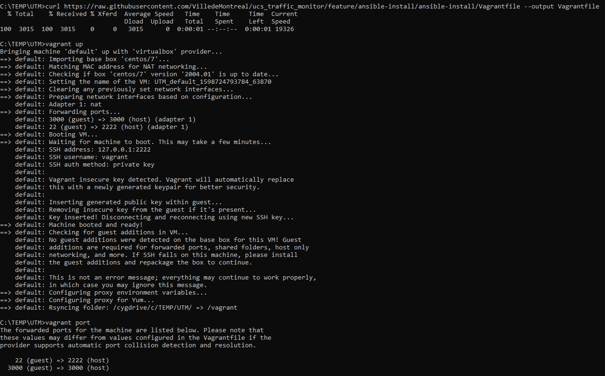
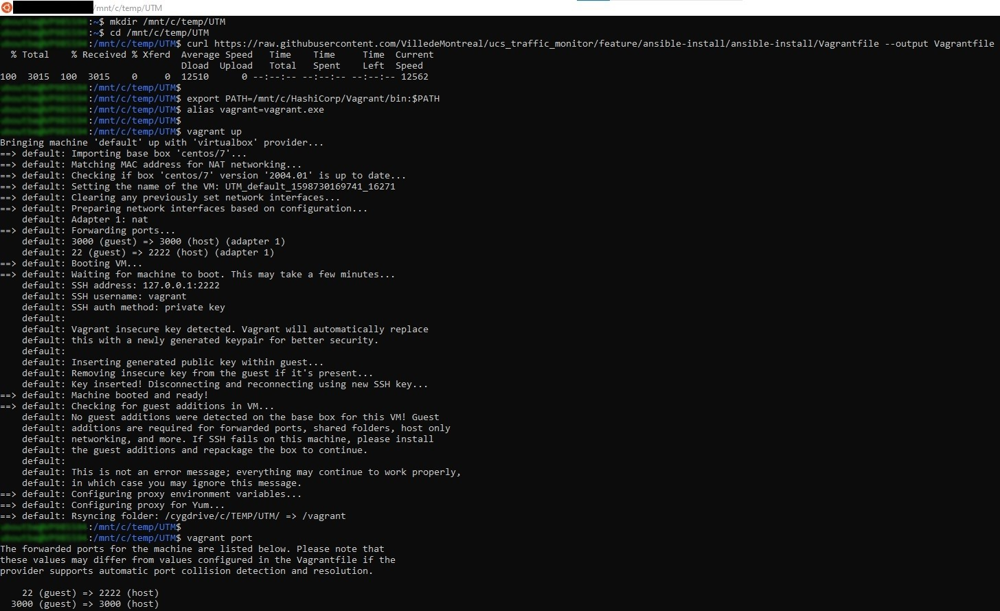
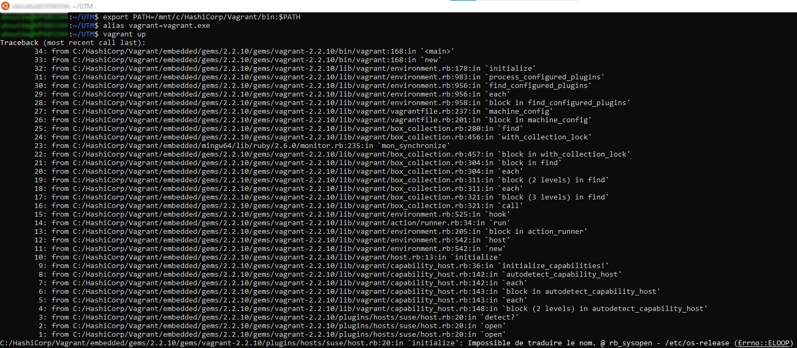
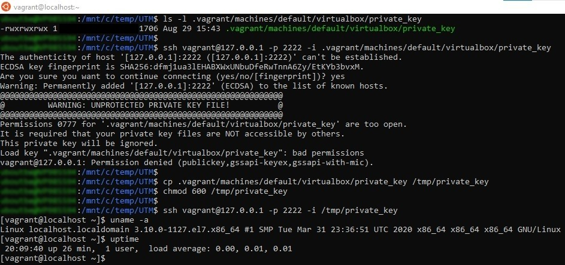
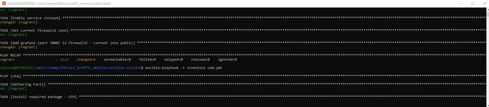
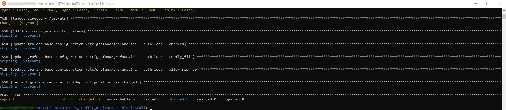
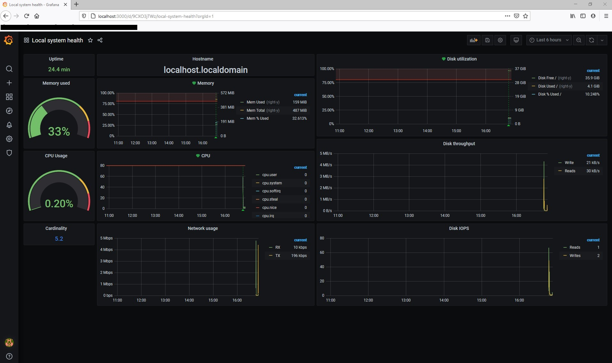

# Ansible installation for UCS Traffic Monitoring (UTM)

ansible-install is merely the automation of all the step proposed by:

https://www.since2k7.com/blog/2020/02/29/cisco-ucs-monitoring-using-grafana-influxdb-telegraf-utm-installation/#DIY_Installation1

Upon successful execution of prereq.yml and utm.yml using ansible, you should get a fully functionnal UTM installation.

These instruction should allow you to use ansible to deploy UTM.  Also, if like me you have to work on Windows, I will described the steps I took to have a fonctionnal Ubuntu running under WSL (v1).  That setup can be use to run Linux tools like ansible.

<br>

## Prerequisites

<br>

- For production deployment, you should have a access to a Redhat based Linux system (Redhat, CentOS, Oracle Linux).  Installation tests took place on CentOS.

- You must have an ssh access to this system and a user that is allowed to run commands as root (sudo)

- The Linux system must be able to access the internet, specifically:
    
    - Base repositories access for OS packages (Linux, EPEL)
    - Base repositories access to use pip (Installer for Python)
    - https://packages.grafana.com (grafana)
    - https://docs.influxdata.com (influxdb and telegraf)

- If you want to be up and running faster, for testing purposes, you can use tool like Vagrant to provision a "local" VM and deploy the UTM stack on it.  In fact, the ansible-install playbooks and been tested this way.  The actual test environnement was :
    
    - Ubuntu 20.04 running under WSL 1 on Windows 10 (2004)
    - Vagrant 2.2.10

- You must have a functionnal ansible installation (tested on 2.9.6)

<br>

### Ansible installation and tests (if required)

<br>

Ansible is generally available from the base OS repositories on all major Linux distribution.

For example, on Ubuntu 18.04 / 20.04, you can get a fully functional ansible using this command :

```shell
sudo apt-get install ansible
```

To allow the utm.yml playbook to work properly, you must use the latest version of the grafana ansible module.  To get it on your ansible system :

```shell
ansible-galaxy collection install community.grafana
```

At this point, if you want to be able to test ansible against your target Linux system (the system where you want UTM to be running), you must modify the inventory file to make reflect your own environment.  The first line of the utm section is the one that must be modified.

In the provided inventory file, the first line allow ansible to connect to a "local" VM that was provisionned using Vagrant.  Since the ssh port can't be the default port 22 when using Vagrant, it must be specified.  Also, Vagrant don't write the (ssh) private_key in the default location so that location also have to be specified.

```shell
[utm]
vagrant ansible_ssh_host=127.0.0.1 ansible_ssh_port=2201 ansible_ssh_user='vagrant' ansible_ssh_private_key_file='.vagrant/machines/default/virtualbox/private_key'
...
```

If you are using a non-Vagrant VM, the first line would look more like :

```shell
[utm]
my_utm_vm ansible_ssh_host=my_utm_vm.my_fqdn ansible_ssh_user='myRemoteUsername'
...
```

In this case, the ansible_ssh_port does not have to be specified (default to 22) and the ssh key is usually available within the default location ($HOME/.ssh).

You can now test that ansible is connecting and working properly against your target Linux system using :

```shell
ansible -i inventory all -m shell -a "uname"
```

If your you don't use SSH key to authenticate and/or you have to provided a password to "become" root using ```sudo```, you could use the following command :

```shell
ansible -i inventory all -m shell -a "uname" --ask-pass --ask-become-pass
```

<br>

## Installation

<br>

### If you are using Vagrant:

<br>

You must start your VM first. To do so :

#### Start Vagrant VM

<br>

```shell
# From the same folder where the provided Vagrantfile is
vagrant up
```

<br>

#### Get the ssh port that Vagrant has configured for your new VM

<br>

```shell
# From the same folder where the provided Vagrantfile is
vagrant port
    22 (guest) => 2201 (host)
  3000 (guest) => 3000 (host)
```

The ansible_ssh_port parameter in the ansible inventory file must reflect the information provided by the ```vagrant port``` command.

<br>

### If you are not using Vagrant:

<br>

Make sure that your ansible inventory file reflect your own environment.

<br>

### Perform the actual UTM stack installation

<br>

#### Review the inventory file before proceeding

<br>

```shell
# System timezone
timezone="America/Toronto"     <<< The timezone of your system

# Enable Linux firewall
enable_linux_fw=true           <<< Do you want iptables to be configure ?

# LDAP/AD configuration (see templates/ldap.toml.ldap_ad for more details)
ldap_ad_enable=false           <<< Do you want to authenticate users using LDAP(AD) in grafana ?
ldap_ad_...

# Update existing images
update_image=false             <<< Do you want to overwrite the images into /usr/share/grafana/public/img/utm (if you ever rerun the playbook) ?

# Update existing dashboard
import_grafana_dashboard=true  <<< Do you want to overwrite the grafana dashboards (if you ever rerun the playbook) ?  This parameter must remain true for the first installation.
```

Except for the "System timezone", the default parameters should be fine.  You could always rerun the playbook if you want to add something (ex. LDAP authentication).

<br>

#### Running the ansible playbooks

<br>

```shell
# If you did not install yet the community.grafana collection on your ansible system yet:
ansible-galaxy collection install community.grafana

# Perform installation (must be run from ansible-install folder)
ansible-playbook -i inventory prereq.yml
ansible-playbook -i inventory utm.yml
```
<br>

**You should now have a functional UTM !**

<br>

The last step is to add IP address and read-only credentials of your UCS domains in:

/usr/local/telegraf/ucs_domains_group_1.txt and/or ucs_domains_group_2.txt

<br>

More information can be found into :

https://www.since2k7.com/blog/2020/02/29/cisco-ucs-monitoring-using-grafana-influxdb-telegraf-utm-installation/#Add_UCS_domains

<br>

## Running UTM on my Windows laptop (you don't have to read this)...

<br>

### Prerequisites

<br>

- Windows 10

- Enable WSL (Windows Subsystem for Linux) v1

  https://www.windowscentral.com/install-windows-subsystem-linux-windows-10

- Install Vagrant (and VirtualBox)

  https://www.vagrantup.com/downloads

<br>

The idea is to use Ubuntu under WSL to allow ansible to run and Vagrant to build a new VM within VirtualBox.  In our case, we then use ansible to run playbooks required to install the UTM stack into that new VM. Simple and easy !  Kind of...

<br>

### Installing ansible under Ubuntu (WSL)

```shell
sudo apt-get install ansible
ansible-galaxy collection install community.grafana
```

Done.

<br>

### Creating/Starting a CentOS 7 VM with Vagrant on Windows from Windows (the normal way)

<br>

Using a Windows "Command Prompt"

```
mkdir C:\TEMP\UTM
cd /D C:\TEMP\UTM
curl https://raw.githubusercontent.com/paregupt/ucs_traffic_monitor/master/ansible-install/Vagrantfile --output Vagrantfile
vagrant up
vagrant port
```



<br>

### Creating/Starting a CentOS 7 VM with Vagrant on Windows from WSL (the "integrated" way)

<br>

Using a Ubuntu "Prompt"

It is possible to execute Windows program from WSL distribution.

```
mkdir /mnt/c/temp/UTM
cd /mnt/c/temp/UTM
curl https://raw.githubusercontent.com/paregupt/ucs_traffic_monitor/master/ansible-install/Vagrantfile --output Vagrantfile

# Add vagrant to the Linux (WSL) path
export PATH=/mnt/c/HashiCorp/Vagrant/bin:$PATH

# Define a Linux style alias
alias vagrant=vagrant.exe

vagrant up
vagrant port
```



<br>

#### Possible issue with vagrant on Windows from WSL

<br>

It does not seam possible to use vagrant from the Linux fs under WSL. My understanding at this time would be that a Windows program such Vagrant cannot write to the Linux fs.

So if you hit that issue...  That why we are using /mnt/c to run Vagrant.



<br>

### Connecting to our new VM with SSH

<br>

Now that our VM is up and running, we should be able to connect to it using ssh (which will be needed to use ansible).

The last issue that we have to solve is the fact that SSH won't accept that a private key is store without proper file permissions.  And since it is not possible to restrict access properly on the Windows fs from WSL...

```
cd /mnt/c/temp/UTM
cp .vagrant/machines/default/virtualbox/private_key /tmp/private_key
chmod 600 /tmp/private_key

ssh vagrant@127.0.0.1 -p 2222 -i /tmp/private_key
```



<br>

### At last, the full execution (now, that should be easy)...

<br>

```
sudo apt-get install ansible
sudo apt-get install git

mkdir /mnt/c/temp/UTM
cd /mnt/c/temp/UTM

git clone https://github.com/paregupt/ucs_traffic_monitor
cd /mnt/c/temp/UTM/ucs_traffic_monitor/ansible-install

# Add vagrant to the Linux (WSL) path
export PATH=/mnt/c/HashiCorp/Vagrant/bin:$PATH

# Define a Linux style alias
alias vagrant=vagrant.exe

vagrant up
vagrant port

cp .vagrant/machines/default/virtualbox/private_key /tmp/private_key
chmod 600 /tmp/private_key

# Modify the inventory file to match the VM just created
head -n 2 inventory
# ---
# [utm]
# vagrant ansible_ssh_host=127.0.0.1 ansible_ssh_port=2222 ansible_ssh_user='vagrant' # ansible_ssh_private_key_file='/tmp/private_key'
# ...
# ---

# Test ansible
ansible -i inventory all -m shell -a "uname"

# Installation UTM (prerequisites for ansible grafana module)
ansible-galaxy collection install community.grafana

# Installation UTM
ansible-playbook -i inventory prereq.yml
ansible-playbook -i inventory utm.yml
```

<br>






<br>

You should be able to connect to grafana at http://localhost:3000 (User :admin, Password : admin) :



<br>

Done.

<br>

**Thanks for reading anyways !**
